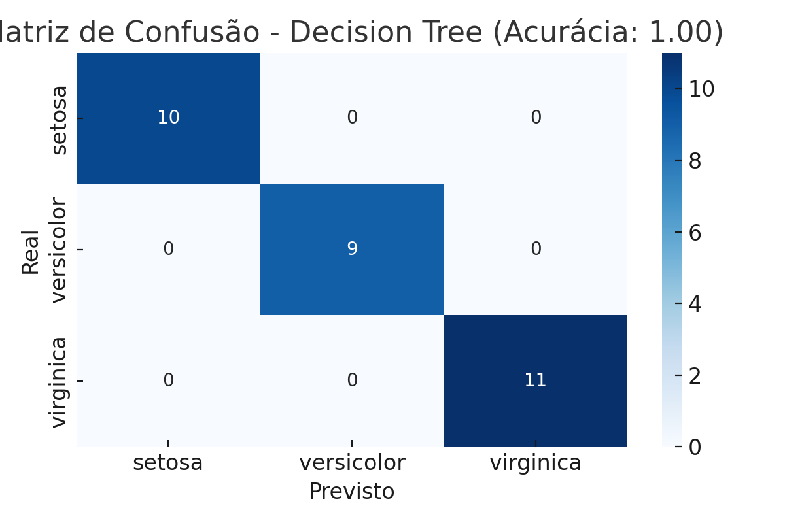

# 🌸 Classificação com Árvore de Decisão - Dataset Iris

Este projeto aplica o algoritmo `DecisionTreeClassifier` do Scikit-Learn no clássico dataset **Iris** (UCI ML Repository).

## 📁 Conteúdo

- `Iris_Classificacao_Colab.ipynb`: Notebook com carregamento do dataset, treino/teste e visualização da árvore.
- `matriz_confusao_iris.png`: Gráfico da matriz de confusão.

## 📊 Resultados

- Acurácia: **100%**
- Nenhum erro de classificação
- Visualização da árvore de decisão com `plot_tree`

## 🧪 Tecnologias

- Python 3.11
- Scikit-learn
- Pandas
- Matplotlib
- Seaborn

## ▶️ Execução

Você pode rodar o notebook diretamente no [Google Colab](https://colab.research.google.com) ou localmente com:

```bash
pip install -r requirements.txt
jupyter notebook Iris_Classificacao_Colab.ipynb
```

---



---

## 📎 Fonte do Dataset

[Iris Dataset - UCI Machine Learning Repository](https://archive.ics.uci.edu/dataset/53/iris)

